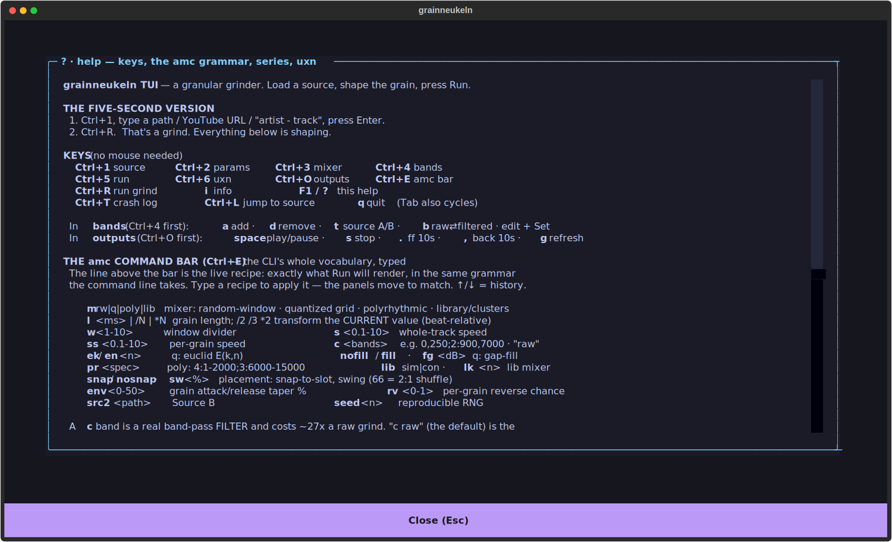

# grainneukeln — a rhythm hallucinator

**In one breath:** give it audio you already have — a song, a field recording, a voice memo — and it
rebuilds it into *new* audio. It slices the sound into tiny **grains** lined up to the beat, then
stitches those grains back together in a shuffled, re-filtered order. The result keeps the original's
pulse and texture but becomes something new — hypnotic, glitchy, remixed. That's **granular
resynthesis**, driven by the source's own rhythm.

Two runs with the same settings give two different tracks (grain picks are random) — but both stay
locked to the source's groove.


---

## Why "rhythm hallucinator"?

Beat detection here never *asks* whether the audio is rhythmic — it fits a pulse to whatever it can
find, and it always has a default tempo in mind (~120 BPM). Feed it literal **white noise** and it
will confidently hear *23 beats at 112 BPM* and grind to it. Feed it a real 400 ms click track and it
nails *400.1 ms*. It runs in two regimes — *locking* to a real pulse, or *hallucinating* one where
there is none — and it never tells you which. That's not a bug; it's the instrument. The imagined
grid is what lets you grind a rainstorm or a room's silence into something that grooves.

> **The one thing to remember:** beatless input is a *use case*, not a failure — but a source with
> **0** detected beats gives the grinder nothing and yields a dead mix. A few beats (real or
> hallucinated) is all it needs.

**→ The full story, the measured proof, and the step-by-step pipeline: [docs/HOW_IT_WORKS.md](docs/HOW_IT_WORKS.md).**

---

## Install (Python 3.12+, no Conda)

```bash
uv venv .venv && . .venv/bin/activate     # or: python3 -m venv .venv && . .venv/bin/activate
pip install -r requirements.txt           # TUI/GUI extras are optional
# system prerequisite: ffmpeg  (pydub uses it for mp3/m4a/webm)
```

Beat detection and time-stretch use **librosa** — no `madmom`/`rubberband` build needed. The Conda
flow still works but isn't required.

---

## Use it — command line

```bash
python main.py <audio file or YouTube URL> <output dir> [amc params]
```

```bash
# default automix — fast path, raw grains (no band-pass filtering)
python main.py song.mp3 output/

# half-length grains, each grain a touch faster, whole mix a touch slower
python main.py song.mp3 output/ amc l /2 ss 1.2 s 0.9

# two frequency bands (bass + air), tighter windows — opts into band-pass filtering
python main.py song.mp3 output/ amc c 1,250;10000,15000 w 6

# reproducible render — same seed + same params = byte-identical output
python main.py song.mp3 output/ amc seed 42 l /2 ss 1.2

# a whole sweep at once — one file per grain length
python main.py song.mp3 output/ amc l [/2,/3,/4]
```

You can also pass a YouTube URL or an `"artist - track"` search string in place of a file, and it
will fetch the audio first.

---

## Use it — TUI (recommended, headless-friendly)

```bash
python main.py --tui
# or: ./run_tui.sh
python main.py song.mp3 out/ --tui              # preload a source, render into out/
python main.py "Aphex Twin - Rhubarb" out/ --tui --seed 42
```

A keyboard-driven terminal UI you can run over SSH inside tmux — no display server needed. It reaches
**everything the command line reaches**: the `amc` grammar is a first-class surface here (via the
command bar, `Ctrl+E`), not a subset re-expressed as widgets, and the line above it is the live
recipe — exactly what Run will render, ready to copy out or paste in.

- **Source** (`Ctrl+1`): file · YouTube URL · `artist - track` search · optional Source B.
- **Params / Mixer / Bands** (`Ctrl+2/3/4`): every `amc` knob, live. Bands are **raw or filtered** —
  a raw band skips the band-pass filter and grinds ~27× faster; each row says which it is, so a slow
  grind is never a mystery.
- **Run** (`Ctrl+5`): WAV / verbose / self-feed / low-mem toggles, the **series** sweep, progress + log.
- **Uxn ROM control** (`Ctrl+6`): drive the params from a portable Uxn sequencer ROM, with a
  **dry-run Preview** that shows the whole plan without spending a render.
- **Outputs** (`Ctrl+O`): renders newest-first with size + age; non-blocking play/pause/seek.

Crash-tolerant: the session is checkpointed before every grind, so a crash (even an OOM) loses only
the render; `Ctrl+T` shows the recipe that bombed. `F1` / `?` opens the full keymap + `amc` grammar
on one screen:



**→ Full walkthrough: [docs/TUI_GUIDE.md](docs/TUI_GUIDE.md).** TUI extra: `textual`.

---

## Use it — GUI

`python main.py` with no arguments launches the PySide6 desktop GUI: load from file or YouTube,
detect beats, configure and run the automixer, play and save. (GUI extras: `PySide6`, `pyqtgraph`.)
Needs a display server — on a headless box, use the TUI above.

---

## The knobs (`amc`)

The `amc` block is a list of `key value` pairs. The handful you'll reach for most:

| param | meaning | example | in short |
|-------|---------|---------|----------|
| `l`  | grain length | `l /2`, `l *3`, `l 250` | `/N`·`*N` scale the beat-derived default by ratio (stays on the grid); a **bare number is absolute ms**. Shorter = finer, more fragmented. |
| `s`  | whole-mix speed | `s 0.8` | tempo of the **final** track (pitch preserved). `<1` slower, `>1` faster. |
| `ss` | per-grain speed | `ss 1.2` | tempo of **each grain** (pitch preserved) — warps the micro-texture. |
| `c`  | channels / bands | `c 0,250;250,15000` | **Opt-in band-pass filtering.** Each `low,high` band pulls its own grain and they're layered. **Omit it for the fast raw-grain default** (4–5× faster). |
| `w`  | window divider | `w 4` | windows = `total_beats / w`. Bigger `w` → tighter windows → more local grain picks. |
| `m`  | mode | `m rw`, `m q`, `m poly`, `m lib` | grain-selection algorithm (see below). `rw` is the default. |
| `seed` | RNG seed | `seed 42` | reproducibility — same params + seed = byte-identical output. Also `--seed 42`. |

There are more — per-grain envelope taper (`env`) and reverse (`rv`), a second source (`src2`),
snap-to-beat (`snap`), swing (`sw`), euclidean patterns (`ek`/`en`), poly streams (`pr`), library
clustering (`lib`/`lk`), and series sweeps (`[...]`).

**→ Every parameter, the cross-mode matrix, and recipes: [docs/PARAMETERS.md](docs/PARAMETERS.md).**

### The four modes at a glance

| mode | what it does | try |
|------|--------------|-----|
| `rw` | **random window** (default) — picks a random beat per grain; the groove is whatever the source had. | `amc m rw` |
| `q`  | **quantized euclidean** — fires grains only on the slots a pattern `E(k,n)` marks: designed grooves (tresillo, cinquillo…) over the source's onsets. | `amc m q ek 3 en 8` |
| `poly` | **phasing polyrhythm** — N parallel streams at different subdivisions, overlaid so they phase (Reich-style). | `amc m poly pr 4;3` |
| `lib` | **feature library** — measures every grain on 4 axes, clusters them, and *sequences* by similarity (`sim`, hypnotic) or contrast (`con`, glitchy). | `amc m lib con lk 8` |

**→ The code-level algorithm for each: [docs/ALGORITHMS.md](docs/ALGORITHMS.md).**

### Series runs — sweep in one command

Wrap any sweepable param's value in square brackets and `amc` renders the **cartesian product** —
one file per combination:

```bash
python main.py song.mp3 output/ amc l [/2,/3,/4]        # 3 renders, grain length varies
python main.py song.mp3 output/ amc l [100:300:50]      # numeric range → 100,150,200,250,300
python main.py song.mp3 output/ amc s [0.8,1.0,1.2] ss [1.0,1.5]   # 6 renders, speed × sample-speed
python main.py song.mp3 output/ amc seed [1,2,3,4,5]    # 5 renders, same recipe, different grain picks
```

`[a,b,c]` is an explicit list; `[start:stop:step]` is an inclusive numeric range. Quote the brackets
in the shell to defeat globbing. Each render's filename encodes its own params so you can tell
combinations apart. The TUI's Run panel and the interactive shell (`am N` runs combination #N) expose
the same grammar. Full grammar and the sweepable-param list are in
[docs/PARAMETERS.md](docs/PARAMETERS.md).

### Interactive shell

Run **without** any `amc` params to drop into an interactive cutter
(`python main.py song.mp3 output/`):

| command | does |
|---------|------|
| `p` | play the current selection |
| `b <ms>` / `l <ms>` | set selection start / length |
| `s <ms>` | set the step size for `f`/`r` |
| `f` / `r` | step forward / rewind (repeat the letter to go further: `fff`) |
| `cut` / `cut -a` | export the current selection (`-a` snaps to a nearby amplitude peak) |
| `autocut [n]` | export many cuts automatically |
| `am` / `am N` | automix the whole track (`am N` renders combination #N after a series `amc`) |
| `amc …` / `amc info` | set automix params / show the current config |
| `load <file>` | load a different track |
| `plot` / `info` | view amplitude / current settings |
| `set_wav_enabled` / `set_wav_disabled` | also export WAV alongside MP3 |
| `help` / `q` | help / quit |

---

## Learn more

| doc | what's in it |
|-----|--------------|
| **[docs/HOW_IT_WORKS.md](docs/HOW_IT_WORKS.md)** | the rhythm-hallucinator character (with measured proof), the pipeline step by step, and performance benchmarks |
| **[docs/PARAMETERS.md](docs/PARAMETERS.md)** | every `amc` parameter, the cross-mode matrix, series-run grammar, and recipes |
| **[docs/ALGORITHMS.md](docs/ALGORITHMS.md)** | the code-level machinery of each mixer — euclidean generator, polyrhythm math, `lib` clustering + Markov sequencing, loudness, determinism |
| **[docs/TUI_GUIDE.md](docs/TUI_GUIDE.md)** | the full TUI walkthrough — every panel, keybinding, and the Uxn ROM control layer |
| **[uxn_ctrl/README.md](uxn_ctrl/README.md)** | driving a whole render sequence from a portable Uxn ROM (`--uxn-ctrl`, `--uxn-feedback`) |

---

## Docker

```bash
./run_granular_sampler.sh
```

Builds the image and runs the container with settings for your OS. Windows users may need an X server
(e.g. VcXsrv) for the GUI.

## Contributing

Contributions welcome — please open a Pull Request.
