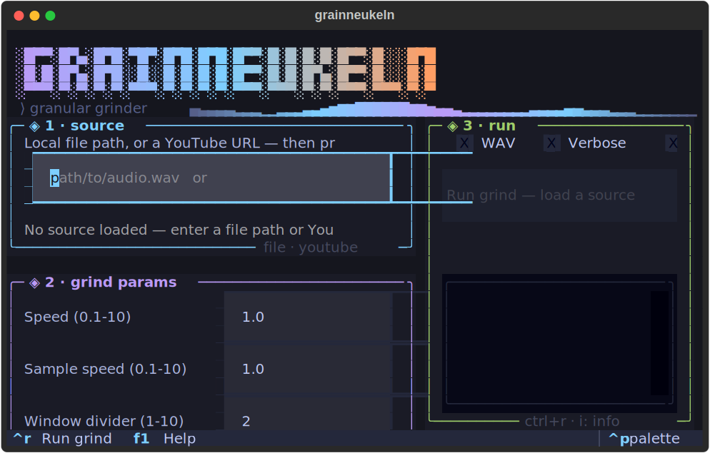

# grainneukeln — a granular sampler

**In one breath:** give it audio you already have — a song, a field recording, a voice memo — and it
rebuilds it into *new* audio. It slices the sound into tiny **grains** lined up to the beat, then
stitches those grains back together in a shuffled, re-filtered order. The result keeps the original's
pulse and texture but becomes something new — hypnotic, glitchy, remixed. That's **granular
resynthesis**, driven by the source's own rhythm.

Two runs with the same settings give two different tracks (grain picks are random) — but both stay
locked to the source's groove.

---

## What's new (2026-07-19)

- **Series runs (ranges + combos)**: bracket any sweepable param's value — `l [/2,/3,/4]`,
  `s [0.8:1.2:0.2]`, `m [rw,q]` — and `amc` renders the cartesian product of every bracketed
  param, one file per combination. Works in the CLI, the TUI (Run panel **Series** field), and
  the interactive shell. See [Series runs](#series-runs--abcc-startstopstep--sweep--cartesian-combos).
- **4-5× faster default path**: band-pass filtering is now opt-in via `c low,high`. Default (no `c`
  arg) uses raw grains — preserves full source spectrum, renders 4-5× faster. See
  [Performance](#performance) for benchmarks.
- **Reproducible renders**: `--seed 42` or `amc seed 42` seeds every mixer's RNG so two runs with
  the same params produce byte-identical output. Useful for A/B testing recipes.
- **O(n) concat/overlay**: refactored from the original O(n²) pattern. Long tracks (30s+) render
  dramatically faster even with band-pass filtering enabled.
- **TUI screenshot**: see the [TUI section](#tui-recommended-headless-friendly) for a visual
  overview of the terminal interface.
- **Uxn external control layer** (issue #13, Option A): `--uxn-ctrl` drives a sequence of
  renders from a tiny portable [Uxn](https://wiki.xxiivv.com/site/uxn.html) ROM instead of
  hand-written params. See [uxn_ctrl/README.md](uxn_ctrl/README.md). The ROM sequences all 6 `amc`
  params — `l w s c ss` **and** `m` (the cutting algorithm: `rw`/`q`/`poly`/`lib`, added
  2026-07-24), so one run moves through cutting *algorithms*, not just their knobs. Add
  `--uxn-feedback` (2026-07-21; adaptive ceiling + per-tick regional 2026-07-24) to close the loop:
  each tick's ROM call is fed a byte measured from the source's own rhythm density (scaled by the
  source's own peak, measured per region), so the sequencer's `c`-band choice reacts to the actual
  audio (`feedback=0` — the default — is a true no-op for `idx_c`).
- **Grain shaping, dual-source grinding + an HPSS axis** (2026-07-21): every grain now gets an
  attack/release taper (`env`, default 8% of the grain's length — `env 0` disables) and an
  optional per-grain reverse (`rv 0.3`); `src2 <path>` loads a **second source** and any `c` band
  prefixed `2:` pulls its grains from it (same beat grid, different raw material); `lib` mode's
  clustering gained a 4th measurement axis (harmonic-vs-percussive ratio via librosa HPSS). See
  the parameter table below and [docs/ALGORITHMS.md](docs/ALGORITHMS.md).


---

## What it *is*: a rhythm-seeking maniac

The mechanics below are only half the story. The other half is its **character**, and it explains
most of what you'll hear:

**It sees rhythm everywhere — including where there is none.** Beat detection doesn't *ask* whether
the audio is rhythmic. It fits a pulse to whatever fluctuation it can find, and it always has a
default tempo in mind (librosa's prior, ~120 BPM). Hand it a beatless field recording, room hum, or
literal white noise, and it will not shrug — it will hear a beat and commit to it:

| what you feed it | what it "hears" |
|---|---|
| white noise (no rhythm whatsoever) | **23 beats, 112 BPM** — a confident pulse, invented |
| 8 real room recordings (ambient hum, no music) | **15–53 beats each; median 123.0 BPM** (range 80.7–184.6) — it never once said "no rhythm here" |
| a real 400 ms click track | **400.1 ms** — dead accurate, when the rhythm is genuinely there |
| a steady drone, or digital silence | *nothing* (0 beats) — it needs some flutter to latch onto |

*(Measured, not asserted — `librosa.beat.beat_track` on real captures, 2026-07-15.)*

So there are two regimes, and it never tells you which one it's in: when a real pulse exists it
locks to it faithfully; when none exists it **hallucinates** one near its 120 BPM prior. Both feel
equally confident downstream. This is not a bug to be fixed — it is the instrument. The imagined
grid is what lets you grind a rainstorm or a room's silence into something that *grooves*.

**Then it cuts everything it hears to fit that rhythm.** Real or imagined, the beat grid becomes the
skeleton: every grain starts on a beat, every window is measured in beats, every chunk is about one
beat long. Nothing survives off-grid. Whatever went in comes out marching.

**And subdividing the grid doesn't break it.** `l /2`, `l /3`, `l *2`, `l *3` scale the grain length
against the beat period by **integer ratios** — so the grains stay metrically coherent with the
pulse it imagined. A grain of `T/3` still lands on the grid every third grain; the *felt* rhythm of
the original (real or invented) is preserved while the texture changes completely. That's why `/3`
sounds like a new reading of the same groove rather than a different tempo: you're re-reading the
grid, not moving it. Change `s` if you want to actually move it.

> Practical upshot: **beatless input is not a failure mode, it's a use case** — but check the beat
> count. A source with 0 detected beats gives the grinder nothing to build on and yields an empty or
> dead mix. Anything with a few beats — real or hallucinated — will grind.

---

## How it works

What actually happens when you run an automix:

1. **Find the beat — or invent one.** The track is analysed into a list of beat positions
   (milliseconds) via `librosa.beat.beat_track`. Everything downstream is anchored to these beats:
   the rhythm of the source becomes the skeleton of the output. Note that this step *cannot fail
   loudly* — given any fluctuating audio it returns a grid, whether or not the source has a pulse
   (see [rhythm-seeking maniac](#what-it-is-a-rhythm-seeking-maniac)). Only a featureless drone or
   silence returns nothing.
2. **Slide a window over the beats.** Rather than look at the whole track at once, a *rolling window*
   moves across the beat list. Its size is `total_beats / window_divider`, so a bigger `w` means a
   smaller, tighter window — grains get drawn from a narrower slice of time.
3. **Fill each window with grains.** For every window it builds a chunk:
   - pick a **random** beat inside the window as the grain's start point,
   - cut a grain `l` milliseconds long from there,
   - run it through a **band-pass filter** for each channel (keep only chosen frequency bands),
   - layer the channels on top of each other,
   - repeat, appending grains, until the chunk is about one beat long.
4. **Optionally bend time.** Each grain can be sped up / slowed (`ss`), and the finished mix as a whole
   can be sped up / slowed (`s`) — pitch-preserving time-stretch.
5. **Concatenate.** All the window-chunks are joined end to end → your new track (MP3, optionally WAV).

```
source audio
  │  detect beats  →  ● ● ● ● ● ● ● ● ● ● ● ●      beat positions (ms)
  │  rolling window   └──[ window ]──┘              size = beats / w
  │                        ├ pick a RANDOM grain start inside the window
  │                        ├ cut a grain (length l)
  │                        ├ band-pass per channel (c)  → layer them
  │                        └ optional per-grain speed (ss)
  │  …one chunk per window, each ~one beat long…
  ▼
new track  =  chunk₁ + chunk₂ + chunk₃ + …          (+ optional whole-mix speed s)
```

> Every export is loudness-normalized (RMS to −16 dBFS, capped at a −1 dBFS true peak so the encode
> never clips) — raw automixes are near-inaudible otherwise. Tunable via `GRAINNEUKELN_TARGET_DBFS` /
> `GRAINNEUKELN_PEAK_DBFS`.

### Deeper reference

The four mixer modes are distinct algorithms, not presets. For the full, code-level treatment — the
euclidean (Bjorklund) generator, the polyrhythm phasing math, the feature-clustering + Markov
sequencing in `lib`, beat-clock derivation, the loudness stage, and a determinism note — see:

- **[`docs/ALGORITHMS.md`](docs/ALGORITHMS.md)** — how each mixer selects, places, and recombines grains.
- **[`docs/PARAMETERS.md`](docs/PARAMETERS.md)** — every `amc` parameter, the cross-mode matrix, and recipes.

---

## Install (Python 3.12+, no Conda)

```bash
uv venv .venv && . .venv/bin/activate     # or: python3 -m venv .venv && . .venv/bin/activate
pip install -r requirements.txt           # GUI extras are optional
# system prerequisite: ffmpeg  (pydub uses it for mp3/m4a/webm)
```

Beat detection and time-stretch use **librosa** — no `madmom`/`rubberband` build needed
(see [PR #3](https://github.com/genaforvena/grainneukeln/pull/3)). The Conda flow still works but
isn't required.

---

## Use it (command line)

```bash
python main.py <audio file or YouTube URL> <output dir> [automix params]
```

```bash
# default automix — fast path, raw grains (no band-pass filtering)
python main.py song.mp3 output/

# half-length grains, each grain a touch faster, whole mix a touch slower
python main.py song.mp3 output/ amc l /2 ss 1.2 s 0.9

# two frequency bands (bass + air), tighter windows — opts into band-pass filtering (slower)
python main.py song.mp3 output/ amc c 1,250;10000,15000 w 6

# reproducible render — same seed + same params = byte-identical output
python main.py song.mp3 output/ amc seed 42 l /2 ss 1.2
```

### Automix parameters — the `amc` block

| param | meaning | example | what it does |
|-------|---------|---------|--------------|
| `l`  | grain length | `l /2`, `l *3`, `l 250` | `/N` or `*N` scales the beat-derived default by a **ratio** (`/N` divide, `*N` multiply; `N` may be fractional in the `amc` path), so the grain stays metrically coherent with the detected (or imagined) pulse — `/3` re-reads the same groove rather than moving it. A **bare number is absolute milliseconds** (`l 2` = 2 ms, *not* 2 beats — use `l *2`), the one way to cut *against* the grid. Shorter = finer, more fragmented texture. |
| `s`  | whole-mix speed | `s 0.8` | tempo of the **final** track (pitch preserved). `<1` slower, `>1` faster. |
| `ss` | per-grain speed | `ss 1.2` | tempo of **each grain** (pitch preserved) — warps the micro-texture. |
| `c`  | channels / bands | `c 0,250;250,15000` | **Opt-in band-pass filtering.** Each `low,high` band pulls its **own** random grain and they're layered — e.g. split bass and treble into independent grain streams. **Default (no `c` arg): raw grains, no filtering** — 4-5× faster, preserves full source spectrum. Explicit `c` opts into the slower filtered path. |
| `w`  | window divider | `w 4` | windows = `total_beats / w`. Bigger `w` → smaller windows → grains drawn from tighter time-neighborhoods (more local, less wandering). |
| `m`  | mode | `m rw`, `m q`, `m poly`, `m lib` | grain-selection algorithm. `rw` (random window) is the tested default; `q` quantized, `poly` polyrhythmic, `lib` feature-library (all below). |
| `lib` `lk` | library policy / clusters (mode `lib`) | `lib con lk 8` | `lib sim`/`lib con` selects the sequencing policy (similarity vs contrast); `lk` sets the cluster count. Only used by `m lib`. |
| `snap` | snap-to-beat | `snap` | pitch-preserving time-stretch of each grain to land exactly in its slot (composable, any mode). Off by default. |
| `sw` | swing % | `sw 66` | micro-timing groove: delay every off-beat grain. `0`/`<=50` = straight (no-op), `66` = 2:1 shuffle. |
| `ek` `en` | euclidean pattern (mode `q`) | `ek 3 en 8` | `E(k, n)`: place `k` grains across `n` beat-subdivision slots as an evenly-spread euclidean rhythm. `E(3,8)` is the tresillo, `E(5,8)` the cinquillo, `E(4,4)` four-on-the-floor. Only used by `m q`. |
| `nofill` `fg` | gap-fill (mode `q`) | `nofill`, `fg -12` | the euclidean pattern leaves `n−k` rest slots silent; by default they're filled with off-grid remnant grains `fg` dB (default −6) below the hits. `nofill` restores the pure silent-rest grid. Only used by `m q`. |
| `pr` | poly streams (mode `poly`) | `pr 4;3`, `pr 4:1-2000;3:6000-15000` | `ratio[@length][:low-high]` stream specs separated by `;`. Each stream fires `ratio` grains per beat; `4;3` is a 3-against-4 polyrhythm. Optional per-stream grain length (ms) and band-pass. Only used by `m poly`. |
| `seed` | RNG seed | `seed 42` | **Reproducibility.** Seeds every mixer's RNG so two runs with the same params produce byte-identical output. Also available as `--seed 42` CLI flag. Default: unseeded (runs differ as before). |
| `env` | envelope taper % | `env 15` | attack/release fade on **every grain**: `pct`% of the grain's own length faded on each edge (clamped to at most half the grain). **Default 8** — always on, since a hard-cut grain boundary is an audible click; `env 0` disables (restores the hard-cut boundaries). |
| `rv` | reverse probability | `rv 0.3` | each grain plays reversed with this probability, `0..1`. **Default 0** (off — today's character unchanged). Decided once per grain, so in multi-band configs all bands share the same forward/reversed state (`rw` draws per channel — each of its channels already cuts from its own position). |
| `src2` | second source | `src2 other.mp3` | **Dual-source grinding.** Loads a second audio file (decoded once, cached by path); bands tagged `2:` in `c` pull their grains from it. The beat grid always comes from the primary source — source 2 only supplies raw material. |
| `2:` | source-2 band prefix (inside `c`) | `c 0,250;2:250,15000` | prefix any `c` band with `2:` and that band's grains are cut from the `src2` file at the same grid positions, **wrapping modulo source 2's length** (a shorter/longer second source never truncates). Untagged bands stay on the primary; a `2:` band without `src2` loaded falls back to the primary. *(Does not apply under `--uxn-ctrl` — the ROM owns the `c` string; see [uxn_ctrl/README.md](uxn_ctrl/README.md).)* |
| `[a,b,c]` / `[lo:hi:step]` | series sweep | `l [/2,/3,/4]`, `s [0.8:1.2:0.2]`, `m [rw,q]` | Wrap any sweepable param's value in brackets to render the **cartesian product** — one render per combination. `[a,b,c]` is a list; `[start:stop:step]` is a numeric range (inclusive). See [Series runs](#series-runs--abcc-startstopstep--sweep--cartesian-combos). |

#### Quantized mode (`m q`) — designed grooves instead of a uniform fill

`rw` picks a random beat per grain and concatenates — the groove is whatever the source had. `q`
subdivides the beat period into `n` slots and fires a grain **only on the slots a euclidean pattern
`E(k, n)` marks**, cutting each grain at a source **onset** snapped to the grid. The output has a
*designed* rhythm (tresillo, cinquillo, …) laid over the source's transients. Two runs differ in grain
content but the **grid placement is deterministic** given the pattern. Beatless input still grinds on
the hallucinated grid (no beat floor — same rhythm-seeking regime as `rw`).

```bash
python main.py song.mp3 output/ amc m q ek 3 en 8      # tresillo
python main.py song.mp3 output/ amc m q ek 5 en 8 ss 1.5   # cinquillo, grains sped up
```

#### Polyrhythmic mode (`m poly`) — N phasing grain streams (Reich-style)

`rw`/`q` run a **single** stream (one grain at a time). `poly` runs **N parallel streams** at
different subdivisions of the same beat grid and **overlays** them, so they phase against each other
(Steve Reich's "Piano Phase", but granular). A stream at `ratio` r fires r grains per beat; two
streams at 4 and 3 give a **3-against-4** polyrhythm that coincides every `LCM(3,4)=12` subdivisions
and drifts out of phase in between. Each stream keeps its own grain length and band-pass, so the
layers stay distinguishable. Beatless input still grinds on the hallucinated grid.

```bash
python main.py song.mp3 output/ amc m poly pr 4;3                 # 3-against-4, full band
python main.py song.mp3 output/ amc m poly pr 4:1-2000;3:6000-15000   # split low vs high band
python main.py song.mp3 output/ amc m poly pr 4@80:1-2000;3@120:6000-15000  # staccato, per-stream length
```

#### Library mode (`m lib`) — sequenced selection instead of random

Every other mode picks grains at random (memoryless). `lib` first builds a **library** of beat-grid
grains, measures each on four axes — spectral centroid, RMS, rhythm-density (onsets/sec), and
harmonic-vs-percussive ratio (librosa HPSS) —
**rank-calibrated against the actual grain set** (so no axis can saturate), clusters them, and then
**sequences** grains with a Markov policy over the clusters:

- `lib sim` (**similarity**) — stay in / near the current cluster → hypnotic, coherent.
- `lib con` (**contrast**) — jump to a distant cluster → jarring, glitchy.

The two policies produce measurably different grain-to-grain motion. Too few grains to cluster degrades
honestly (reported), it does not fake a full clustering.

```bash
python main.py song.mp3 output/ amc m lib sim lk 6     # coherent, stays in-cluster
python main.py song.mp3 output/ amc m lib con lk 8     # glitchy, jumps between clusters
```

#### Snap-to-beat + swing (`snap`, `sw`) — composable placement effects

Two small effects usable by any mode. **Snap** (`snap`) pitch-preservingly time-stretches each grain so
off-length material lands *exactly* in its beat slot instead of smearing the groove. **Swing** (`sw`)
applies a micro-timing offset so the output breathes instead of marching: `sw 66` is a 2:1 shuffle,
`sw 0` (or `<=50`) is a genuine no-op (bit-identical straight placement).

```bash
python main.py song.mp3 output/ amc m q ek 3 en 8 snap sw 66   # tresillo, snapped, shuffled
python main.py song.mp3 output/ amc snap                       # snap composed onto the rw baseline
```

#### Series runs (`[a,b,c]`, `[start:stop:step]`) — sweep + cartesian combos

Wrap any sweepable param's value in square brackets and `amc` renders the **cartesian product** of
every bracketed param — one render per combination, each written to its own file. Without brackets,
`amc` stays the legacy one-shot path; with brackets, it iterates. The bracket grammar is the only
amc extension — there is no conflict with `c`'s `low,high;...` or `pr`'s `4;3` (those commas and
semicolons live *inside* a single value, never inside `[...]`).

Two forms inside the brackets:

| form | meaning | example |
|------|---------|---------|
| `[a,b,c]` | explicit list (numbers, `/N`, `*N`, mode words, `sim`/`con`) | `l [/2,/3,/4]` · `m [rw,q]` |
| `[start:stop:step]` | numeric range, inclusive endpoints | `l [100:300:50]` → 100,150,200,250,300 |

Sweepable params: `l` `s` `ss` `w` `m` `ek` `en` `sw` `fg` `lk` `lib` `seed`. Parameters *not*
bracketed stay constant across every render in the sweep (their value is held while the bracketed
ones vary). Ratios inside a list (`/2`, `*3`) resolve against the current base at expand time,
exactly as a single `l /2` would.

```bash
# 3 renders — same recipe, only grain length varies
python main.py song.mp3 output/ amc l [/2,/3,/4]

# 5 renders — numeric range, 50ms step
python main.py song.mp3 output/ amc l [100:300:50]

# 6 renders — cartesian sweep of speed × sample-speed
python main.py song.mp3 output/ amc s [0.8,1.0,1.2] ss [1.0,1.5]

# 4 renders — vary mode + window together (l held constant)
python main.py song.mp3 output/ amc l 300 m [rw,q] w [2,4]

# 5 renders — same recipe, only RNG differs (the "variance pack": same params, different grain picks)
python main.py song.mp3 output/ amc seed [1,2,3,4,5]
```

Each render's filename encodes its own params (e.g. `l150_w4_s0.9_…`) so you can tell combinations
apart at a glance. Quote the bracket in the shell to defeat globbing:

```bash
python main.py song.mp3 output/ amc 'l' '[/2,/3,/4]'   # quotes are safest
```

The TUI exposes the same grammar in the Run panel — type e.g. `l [/2,/3] s [0.8,1.0]` into the
**Series** field and `Ctrl+R` runs every combination, with `i/n` progress per render. The
**interactive shell** arms the series on `amc …` and runs all combinations on `am`; `am 3` runs
only the third combination (1-based), useful for re-rendering one entry from a sweep.

### Interactive shell

Run **without** automix params to drop into an interactive cutter
(`python main.py song.mp3 output/`):

| command | does |
|---------|------|
| `p` | play the current selection |
| `b <ms>` / `l <ms>` | set selection start / length |
| `s <ms>` | set the step size for `f`/`r` |
| `f` / `r` | step forward / rewind (repeat the letter to go further: `fff`) |
| `cut` / `cut -a` | export the current selection (`-a` snaps to a nearby amplitude peak) |
| `autocut [n]` | export many cuts automatically |
| `am` | automix the whole track |
| `am N` | after a series `amc l [/2,/3,/4]`, render only combination #N (1-based) |
| `amc …` / `amc info` | set automix params / show the current config (a series spec arms `am`) |
| `load <file>` | load a different track |
| `plot` / `info` | view amplitude / current settings |
| `set_wav_enabled` / `set_wav_disabled` | also export WAV alongside MP3 |
| `help` / `q` | help / quit |

---

## TUI (recommended, headless-friendly)

```bash
python main.py --tui
# or: ./run_tui.sh
```

A keyboard-driven terminal UI you can run over SSH inside tmux — no display server needed. One screen:
load a source (file path or YouTube URL), edit the grain params live (speed, sample-speed, window
divider, sample length), manage the **multitrack** channel bands as track rows (`a` add, `d` remove,
`enter` edit each track's low/high Hz), run the grind with a progress bar + log (`r`), and browse /
preview the rendered mixes. TUI extra: `textual`. This is the primary interface; the Qt GUI below
stays for desktop use.

**Screenshot:**



*The TUI showing a quantized euclidean grind (E(3,8) tresillo) with two band-pass tracks. The left
panel shows source + params + mode selection; the right panel shows the run log + output browser.*

---

## GUI

`python main.py` with no arguments launches the PySide6 GUI: load from file or YouTube, detect beats,
configure and run the automixer, play and save. (GUI extras: `PySide6`, `pyqtgraph`.) Needs a display
server — on a headless box use the TUI above.

---

## Performance

The automixer's concat/overlay is now **O(n)** in output length (refactored 2026-07-19 from the
original O(n²) pattern). The dominant cost is the per-grain band-pass filter when you opt into it
with `c low,high`:

**Speed comparison (30s source, measured 2026-07-19):**

| mode | BPF-on (explicit `c`) | BPF-off (default) | speedup |
|------|----------------------|-------------------|---------|
| rw   | 27.4s                | 6.0s              | 4.6×    |
| q    | 2.75s                | 0.82s             | 3.4×    |
| poly | 5.65s                | 1.23s             | 4.6×    |
| lib  | 2.64s                | 0.62s             | 4.3×    |

**Recommendation:** use the default (no `c` arg) for fast iteration and exploration. Opt into
explicit `c low,high` bands when you want the filtered character or multi-band layering. Short clips
(a few seconds) render in milliseconds on either path.

---

## Docker

```bash
./run_granular_sampler.sh
```

Builds the image and runs the container with settings for your OS. Windows users may need an X server
(e.g. VcXsrv) for the GUI.

## Contributing

Contributions welcome — please open a Pull Request.
