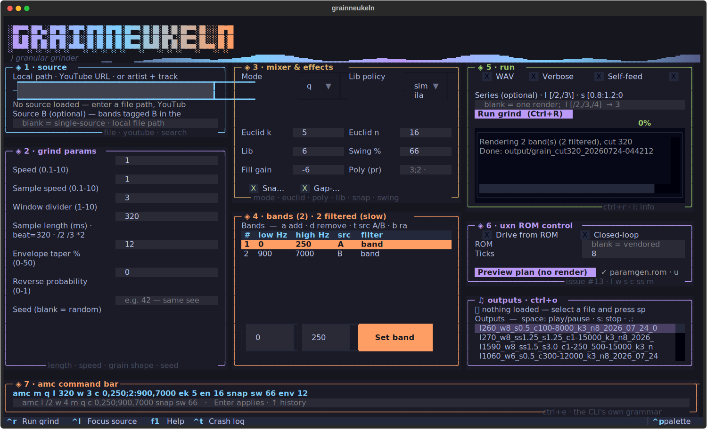

# grainneukeln TUI — user guide

A keyboard-driven terminal interface to the whole grinder. It runs over SSH, needs no display
server, and reaches **everything the command line reaches** — the `amc` grammar is a first-class
surface here, not a subset re-expressed as widgets.

```sh
./run_tui.sh                          # or:
python main.py --tui
python main.py song.mp3 out/ --tui    # preload a source, render into out/
python main.py "Radiohead - Karma Police" out/ --tui --seed 42
```



---

## The five-second version

1. **Ctrl+1**, type a path, a YouTube URL, or `artist - track`, press **Enter**.
2. **Ctrl+R**.

That is a grind. The file lands in `output/` and appears in the outputs panel, newest first.
Everything below is shaping.

---

## The screen

| | panel | what it is for |
|---|---|---|
| **Ctrl+1** | ◈ 1 source | load Source A (file · URL · search) and optionally Source B |
| **Ctrl+2** | ◈ 2 grind params | length, speeds, window, grain envelope, reverse, seed |
| **Ctrl+3** | ◈ 3 mixer & effects | which mixer, and its per-mode knobs + snap/swing |
| **Ctrl+4** | ◈ 4 bands | the multiband list — raw or filtered, Source A or B |
| **Ctrl+5** | ◈ 5 run | output toggles, the series sweep, Run, progress, log |
| **Ctrl+6** | ◈ 6 uxn ROM control | drive the params from a Uxn sequencer ROM |
| **Ctrl+O** | ♫ outputs | renders, newest first, with size and age; playback |
| **Ctrl+E** | ◈ amc command bar | type any recipe; the live recipe line above it |

`Tab` also cycles. `F1` / `?` opens the full help. `q` quits. `i` dumps the live config into the
run log. `Ctrl+T` shows the last crash, whole.

---

## The amc command bar (Ctrl+E)

The line above the bar is the **live recipe** — exactly what Run will render, written in the same
grammar the command line takes. Type a recipe into the bar and the panels move to match; edit a
panel and the line updates. There is one fact and two views of it, never two claims.

```
amc m q l 320 w 3 c 0,250;900,7000 ek 5 en 16 snap sw 66 seed 7
```

`↑`/`↓` walks your history. A partly-wrong line still applies its good half and names every bad
token, so one typo does not cost you a twenty-token recipe.

### Grammar

| token | meaning |
|---|---|
| `m rw\|q\|poly\|lib` | the mixer — random-window · quantized grid · polyrhythmic · library/clusters |
| `l <ms>` · `l /N` · `l *N` | grain length; `/2` `/3` `*2` transform the **current** value |
| `w <1-10>` | window divider |
| `s <0.1-10>` | whole-track speed |
| `ss <0.1-10>` | per-grain speed |
| `c <bands>` | `0,250;900,7000` — a `2:` prefix pulls that band from Source B; `raw` = no filter |
| `ek <n>` `en <n>` | **q**: euclidean pattern E(k, n) |
| `nofill` / `fill` · `fg <dB>` | **q**: stitch off-grid remnants into rest slots, and at what level |
| `pr <spec>` | **poly**: `4:1-2000;3:6000-15000` — ratio\[@length\]\[:low-high\], `;`-separated |
| `lib sim\|con` · `lk <n>` | **lib**: Markov policy over feature clusters, and the cluster count |
| `snap` / `nosnap` · `sw <%>` | placement: pitch-preserving snap-to-slot; swing (66 = 2:1 shuffle) |
| `env <0-50>` | grain attack/release taper, % of grain length |
| `rv <0-1>` | per-grain reverse probability |
| `src2 <path>` | Source B |
| `seed <n>` | seed every mixer's RNG — same seed + params = byte-identical render |

Knobs a mixer does not use are ignored, exactly as on the command line.

---

## Bands: raw vs filtered (this is the speed knob)

Each row in the bands panel is one band the grinder renders; the mix is their sum.

- **raw** — a pass-through. No band-pass filter runs. This is the default, and it is what the CLI
  does when you write no `c` token at all.
- **band** — a real band-pass filter over `low..high` Hz.

Filtering is **the** expensive thing in a grind: measured on a 20-second clip, one raw band renders
in **0.14 s** where the same grind through one filtered 0–15000 band takes **3.77 s** — 27×. The
panel's title says how many rows are filtered, so a slow grind is never a mystery.

Naming a band (Set, or `c 0,250` in the bar) turns the filter on for that row — which is what you
want when you mean it. `b` toggles a row back to raw. Keys, with the panel focused (Ctrl+4 first):

| key | |
|---|---|
| `a` | add a band |
| `d` | remove the selected band |
| `t` | flip it between Source **A** and Source **B** |
| `b` | flip it between **raw** and **filtered** |
| type low/high + `Set` | retune it (and switch it to filtered) |

---

## Series — render a sweep, not one file

Bracket any value, in the amc bar or the Run panel's Series field:

```
l [/2,/3,/4]           →  3 renders
s [0.8:1.2:0.2]        →  3 renders   (range = start:stop:step)
l [/2,/3] m [rw,q]     →  4 renders   (cartesian product)
seed [1,2,3,4,5]       →  5 takes of one recipe, different RNG each — the variance pack
```

Un-bracketed params hold constant across the sweep. Each combination's label goes into its
filename, so file ↔ recipe stays correlatable afterwards. The progress bar spans the whole series,
not each render.

---

## Uxn ROM control (Ctrl+6)

A [Uxn](https://wiki.xxiivv.com/site/uxn.html) ROM runs as a separate process, emits one `amc` line
per tick, and the grinder renders it — the sequencer decides the params, the DSP stays in Python.
The ROM owns **`l w s c ss m`**, including `m`: a run moves through cutting **algorithms**
(`rw → q → poly → lib`, changing every 4 ticks), not just one algorithm's knobs.

Everything the ROM does *not* emit — `env`, `rv`, euclid `ek`/`en`, gap-fill, the poly stream spec,
the lib policy and clusters, `snap`, `sw`, `seed` — comes from your panels and holds for the whole
run. Per-track A/B tags and Source B do **not** apply: the ROM writes the band string itself, so no
band can pull from Source B. The TUI says so out loud rather than dropping them silently.

**Preview plan** ticks the ROM *without rendering anything* and prints the sequence, marking each
tick where the algorithm changes and summarising the mode path. Use it to read a plan before
spending N grinds on it, and to smoke-test a hand-written ROM — a ROM that emits nothing fails here
in a second instead of on tick 0 of an hour-long run. It also checks that `uxncli` exists at all
(`bin/` is gitignored; a fresh clone needs `uxn_ctrl/build.sh`).

**Closed-loop** feeds each tick a byte measured from the source's own rhythm density in the region
that tick is working over, so the band choice reacts to the audio instead of ticking a fixed table.

---

## Outputs and playback

Newest first, with size and age — enough to tell a 4-second dud from a real render without leaving
the panel. Both `.mp3` and the `.wav` the WAV toggle writes are listed. With the panel focused
(Ctrl+O):

| key | |
|---|---|
| `space` | play / pause / resume |
| `s` | stop |
| `.` / `,` | forward / back 10 s |
| `g` | refresh the list |

Playback is non-blocking — the UI stays live while a track plays, and closing the TUI stops it.

---

## Crash-tolerance

The session is checkpointed to `~/.mesh/grainneukeln-session.json` before every grind and on exit,
so a crash — including an OOM that takes the whole process — loses the render and nothing else.
Relaunch and everything you typed is back, with the source path ready to re-load (deliberately not
re-loaded: the grind that crashed may be the reason).

`Ctrl+T` shows the last crash record from `~/.mesh/grainneukeln-crash.log`: the **recipe** that
bombed, the source, and the whole traceback. The log is append-only, so a pattern across several
crashes (“always at `l 160` with two filtered bands”) is readable.

Both paths are overridable via `$GRAINNEUKELN_SESSION` and `$GRAINNEUKELN_CRASH_LOG`.

---

## Command-line flags that pre-arm the TUI

```sh
python main.py song.mp3 out/ --tui                  # preload the source, render into out/
python main.py song.mp3 out/ --tui --seed 42        # reproducible session
python main.py song.mp3 out/ --tui --low-memory     # aggressive GC for small nodes
python main.py song.mp3 out/ --tui --uxn-ctrl --uxn-ticks 16 --uxn-feedback
```

Flags typed at launch override the restored session — they are the newer statement of intent.

---

## Troubleshooting

**"Cannot run: No source loaded"** — Run stays disabled until a source has actually landed, so this
and "Loaded: N beats" can never both be on screen. Watch the source status line: it streams the
download percentage and the librosa beat-detection stage.

**A grind takes minutes.** Check the bands panel title. Every filtered band multiplies the cost;
the mixer is also ~O(n²) in source length, so a full song is genuinely slow. Grind a cut of it, or
set the bands to raw.

**"uxncli not built"** — run `uxn_ctrl/build.sh`. `bin/` is gitignored on purpose: every machine
builds its own ~26 KB emulator, and the ROM itself is byte-identical everywhere.

**Nothing plays.** Playback shells out to `ffplay`/`mpv`/`pydub`; on a headless node with no audio
device there may be nothing to play *to*. The panel says so rather than pretending.

**A key does nothing.** Bare-letter shortcuts are panel-local by design — `a` adds a band only when
the bands panel has focus, so typing `a` into the source box inserts an `a`. Jump first (Ctrl+4),
then press the letter. Ctrl-prefixed keys always fire.
